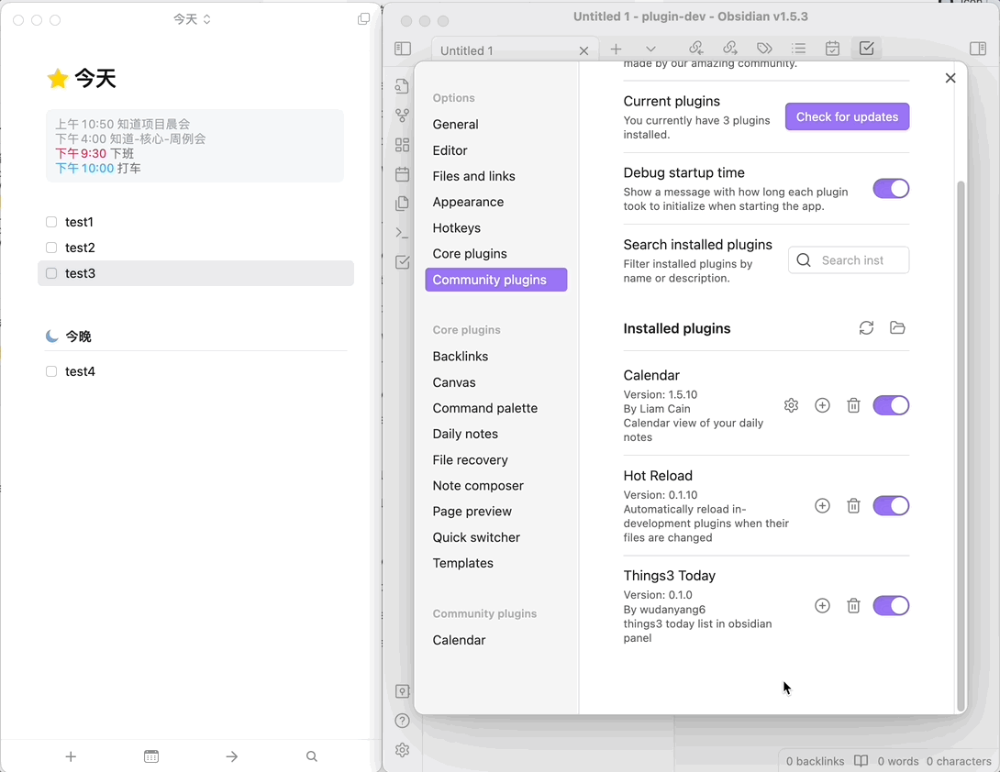

# Things3 Today Plugin

## Introduction

The Things3 Today Plugin allows you to view and manage your today's tasks from the Things3 app directly within an Obsidian pane. This plugin is designed to help you seamlessly integrate task management with your note-taking workflow in Obsidian.

## Features

- Displays your Today list from Things3 within Obsidian
- Supports marking tasks as complete with a single click
- Automatically refreshes the task list every 30 seconds to keep your view up to date.
- Clean and simple user interface for seamless integration

## Installation

1. Open Settings in Obsidian.
2. Navigate to the "Community Plugins" section.
3. Click on "Browse" and search for "Things3 Today".
4. Find the plugin and click "Install".
5. Once installed, enable the plugin from the list of installed plugins.

Please ensure that you have Things3 installed and running on your device.

## Usage

Once the plugin is installed and enabled, you can view and interact with your Today tasks by following these steps:

1. Click on the "Open Things3 Today" button in the side bar.
2. Your Today task list will be displayed in the pane.
3. Click the checkbox next to any task to mark it as completed in Things3.
4. Click the "Refresh" button to refresh your Today task list

When interacting with Things3, a prompt may appear asking for permission to perform operations. You will need to click "Allow" to enable the plugin to communicate with Things3 and perform task updates.

showcase: 

## Configuration

The current version of the plugin does not require any additional configuration.

## Support and Issue Reporting

If you encounter any issues or need assistance, please reach out through:

- GitHub Issue Tracker: https://github.com/wudanyang6/obsidian-things3-today/issues
- Email: wu.danyang@qq.com

Feedback and suggestions are always welcome!

## Contributing

If you would like to contribute code or suggestions to this plugin, please feel free to submit a Pull Request on GitHub or contact us directly.

## License

The Things3 Today Plugin is released under the MIT LICENSE. For more information, please check the LICENSE file.
