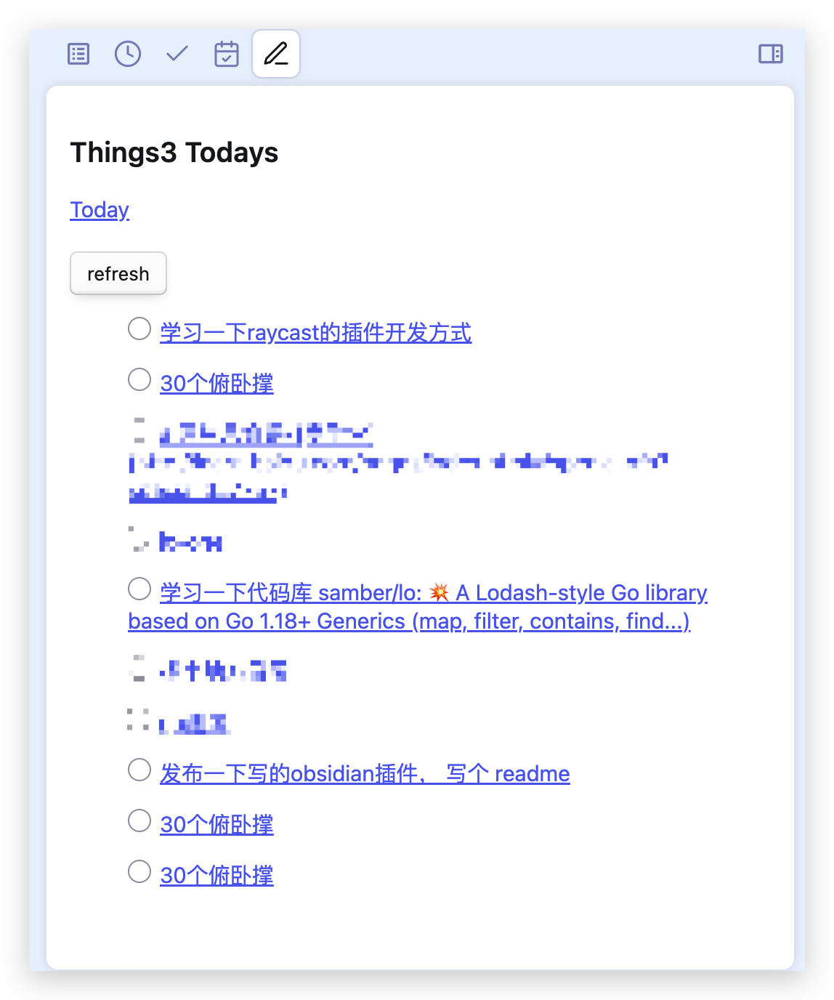

# Install

download this respository, and run the following command in the root directory of this repository:

```bash
npm run build
```

copy the generated `main.js` and `things.js` to `${vault}/.obsidian/plugins/obsidian-things/`

reload the obsidian, and enable the plugin in the settings.

# Usage

show todo list in the sidebar 



1. click the todo item to open the corresponding note in things
2. click the checkbox to mark the todo item as done 
3. click the refresh button to refresh the todo list
4. click the today button to show the todo list of today in things